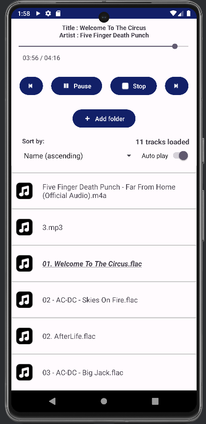
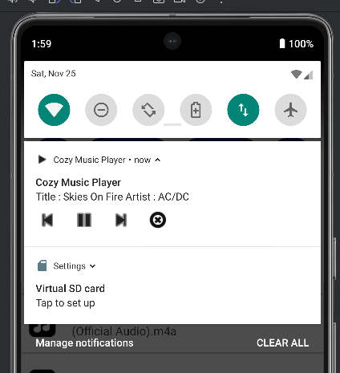
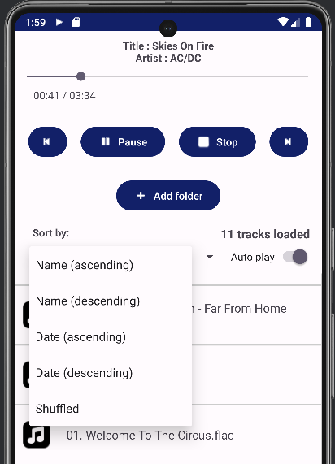

# Cozy Music Player
This is a FOSS music player for Android, written in Kotlin. 
**This app only uses the Android SDK and does not rely on any external libraries.**

# Installation
To install this app, head over to the "Releases" tab of this Github repository and download the APK file.  
To install APK files, you must enable unknown sources for your browser in your device settings.  
**Important note :** When installing, you must accept the Play Protect dialog to install (because the APK file in this repo uses an unsigned certificate).

# Compatibility and device testing
The app requires a device with Android 5.0 or newer. 
All features have been tested on these Devices and are working :
- Android 6 (Xperia Z2)
- Android 9 (Pixel emulator)
- Android 11 (Nokia 6.2)
- Android 12 (Moto Edge 30 Pro, Moto G72)
- Android 13 (Samsung A52s, Samsung A51)
- Android 14 (Pixel emulator)

# Features
- Playback for audio files (.mp3, .m4a, .ogg, .wav, .flac, .3gp)
- Usage of Scoped storage, for enhanced user privacy and best user experience (Basically means the app wont request file permission, and you can give access to specific folders on your device, NOT every folder, therefore enhancing privacy.)
- Background service for music playback in the background, comes with a music playback notification that includes all basic playback controls
- Automatic pausing of music playback when a phone call is placed (works when receiving AND placing a call and also works without requiring phone permission.)
- Sorting of music list by Name or File date (descending or ascending)
- Shuffle track list
- Light theme and Dark theme (Automatically set according to your device theme)

# Another note
This app is fully open source, and **does not require ANY runtime android permissions**, respecting your privacy. 
All functions described above are working and tested on Android 6-14 without any runtime permissions.

# User interface preview
   
   
   